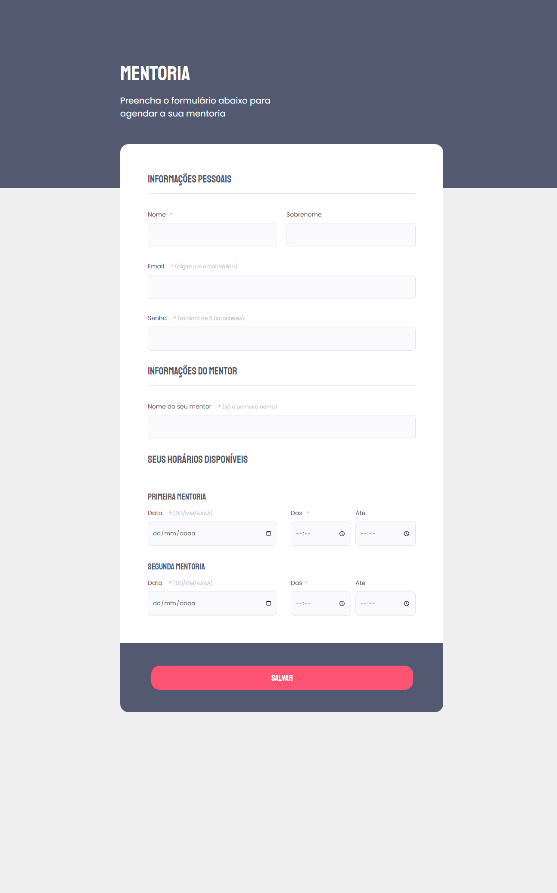

<h1 align="center">
Mentorship Form - Agende sua mentoria
</h1>

## Indexes

- [About](#about)
- [Built in](#built_in)
- [Go to](#go_to)
- [Preview](#preview)

 

## About 

Project completed at the end of the 1st module of Explorer Level 3 - Rocketseat.

It was applied knowledge about forms, mandatory fields, types of inputs, such as text, password, email, date and time, as well as a submit button and accessibility.

 

## Built in 

- HTML
- CSS

 

## Go to 

To access the site is simple, just click on the <a href = "https://mentorship-form.vercel.app">link</a>

 

## Preview 

 

